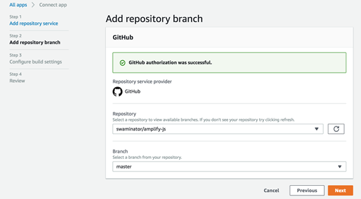
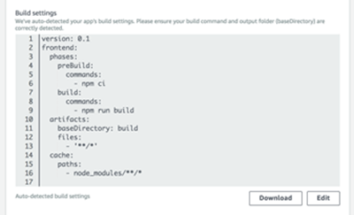
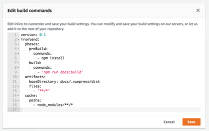
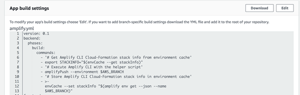
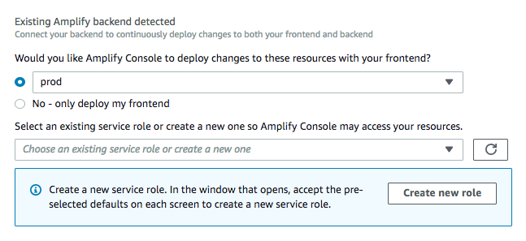

.. _amplify-getting-started:

###############
Getting Started
###############

In this walkthrough, you learn how to continuously build, deploy, and host a modern web app. Modern web apps include Single Page App (SPA) frameworks (for example, React, Angular, or Vue) and static-site generators (SSGs) (for example, Hugo, Jekyll, or Gatsby). 

To get started, log in to the `Amplify Console <https://console.aws.amazon.com/amplify/home>`__ and choose **Get Started** under **Deploy**.

.. image:: images/amplify-gettingstarted-1.png

Step 1: Connect Repository
================================

Connect your GitHub, Bitbucket, GitLab, or AWS CodeCommit repositories. After you authorize the Amplify Console, Amplify fetches an access token from the repository provider, but it *doesn't store the token* on the AWS servers. Amplify accesses your repository using deploy keys installed in a specific repository only. 

.. image:: images/amplify-gettingstarted-2.png

After you connect the repository service provider, choose a repository, and then choose a corresponding branch to build and deploy.

Step 2: Confirm Build Settings for the Front End
======================================

For the selected branch, Amplify inspects your repository to automatically detect the sequence of build commands to be executed. 

**Important:** Verify that the build commands and build output directory (that is, artifacts\baseDirectory) is accurate. If you need to modify this information, choose **Edit** to open the YML editor. You can save your build settings on our servers, or you can download the YML and add it to the root of your repo (for monorepos, store the YML at the app's root directory).

For more information, see :ref:`YML structure <yml-specification-syntax>`.
 

Step 3: Confirm Build Settings for the Backend (beta)
======================================

The Amplify Console detects apps that are using the Amplify Framework and can deploy backend resources in a single workflow with the front end build. This enables you to manage production and test environments with your Git workflow.

To deploy backend functionality using the Amplify CLI during your build, create or reuse an IAM service role. IAM roles are a secure way to grant the Amplify Console permissions to act on resources in your account. 

**Note:** The Amplify CLI won't run without an IAM service role enabled. 

For more information, see :ref:`Deploy a serverless backend with the Amplify Console. <deploy-backend>`.

Step 4: Add Environment Variables (Optional)
=================================================

Almost every app needs to get configuration information at runtime. These configurations can be database connection details, API keys, or different parameters. Environment variables provide a means to expose these configurations at build time.

Step 5: Save and Deploy
=================================================

Review all of your settings to ensure everything is set up correctly. Choose **Save and deploy** to deploy your web app to a global content delivery network (CDN). Your front end build typically takes 1 to 2 minutes but can vary based on size of the app. 

Access the build logs screen by selecting a progress indicator on the branch tile. A build has the following stages:

1. **Provision** - Your build environment is set up using a Docker image on a host with 4 vCPU, 7GB memory. Each build gets its own host instance, ensuring that all resources are securely isolated. The contents of the Docker file are displayed to ensure that the default image supports your requirements.

2. **Build** - The build phase consists of three stages: setup (clones repository into container), deploy backend (runs the Amplify CLI to deploy backend resources), and build front end (builds your front-end artifacts). 

3. **Deploy** - When the build is complete, all artifacts are deployed to a hosting environment managed by Amplify. Every deployment is atomic - atomic deployments eliminate maintenance windows by ensuring that the web app is only updated after the entire deployment has completed.

4. **Verify** - To verify that your app works correctly, Amplify renders screen shots of the index.html in multiple device resolutions using Headless Chrome.

   .. image:: images/amplify-gettingstarted-8.png

Next Steps
=================

* :ref:`Add a custom domain to your app <custom-domains>`

* :ref:`Manage multiple environments <multi-environments>`
   
