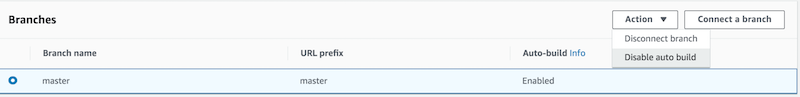

.. _build-settings:

##########################
Configuring Build Settings
##########################

The Amplify Console automatically detects the front end framework and associated build settings by inspecting the package.json file in your repository. You have the following options:

* Save the build settings in the Amplify Console - The Amplify Console autodetects build settings and saves it so that they can be accessed via the Amplify Console. These settings are applied to all of your branches unless there is a YML file found in your repository.

* Save the build settings in your repository - Download the amplify.yml file and add it to the root of your repository (or root of the app folder for monorepos).

You can edit these settings in the Amplify Console by choosing **App Settings>Build settings**. These build settings are applied to all the branches in your app, except for the branches that have a YML file saved in the repository.

.. _yml-specification-syntax: 
 
YML Specification Syntax
========================

The build specification YML contains a collection of build commands and related settings that the Amplify Console uses to run your build. The YML is structured as follows:

.. code-block:: yaml

    version: 1.0
    env:
      variables:
          key: value
    backend:
      phases:
        preBuild:
          commands:
            - *enter command*
        build:
          commands:
            - *enter command*
        postBuild:
            commands:
            - *enter command*
    frontend:
      phases:
        preBuild:
          commands:
            - cd react-app
            - npm ci
        build:
          commands:
            - npm run build
      artifacts:
        files:
            - location
            - location
        discard-paths: yes
        baseDirectory: location
      cache:
        paths:
            - path
            - path
      customHeaders:
       - pattern: 'file-pattern'
         headers:
         - key: 'custom-header-name'
           value: 'custom-header-value'
         - key: 'custom-header-name'
           value: 'custom-header-value'
    test:
      phases:
        preTest:
          commands:
            - *enter command*
        test:
          commands:
            - *enter command*
        postTest:
          commands:
            - *enter command*
      artifacts:
        files:
            - location
            - location
        configFilePath: *location*
        baseDirectory: *location*

* **version** - Represents the Amplify Console YML version number.
* **env** - Add environment variables to this section. You can also add environment variables using the console.
* **backend** - Run Amplify CLI commands to provision a backend, update Lambda functions, or  GraphQL schemas as part of continuous deployment. Learn how to :ref:`deploy a backend with your frontend <deploy-backend>`.
* **frontend** - Run frontend build commands.
* **test** - Run commands during a test phase. Learn how to :ref:`add tests to your app <running-tests>`.
* The frontend, backend, and test have three **phases** that represent the commands run during each sequence of the build.
    * **preBuild** - The preBuild script runs before the actual build starts, but after we have installed dependencies.
    * **build** - Your build commands.
    * **postBuild** - The post-build script runs after the build has finished and we have copied all the necessary artifacts to the output directory.
* **artifacts>base-directory** - The directory in which your build artifacts exist.
* **artifacts>files** - Specify files from your artifact you want to deploy. `**/*` is to include all files.
* **cache** - The buildspec's cache field is used to cache build-time depedencies such as the `node_modules` folder, and is automatically suggested based on the package manager and framework that the customer’s app is built in. During the first build, any paths here are cached, and on subsequent builds we re-inflate the cache and use those cached dependencies where possible to speed up build time. 
* **customHeaders** - Custom header rules set on deployed files. See :ref:`custom headers <custom-headers>`.

Branch-Specific Build Settings
=====================================

You can use bash shell scripting to set branch-specific build settings. For example, the following script uses the system environment variable `$AWS_BRANCH` to execute one set of commands if the branch name is `master` and a different set of commands if the branch name is `dev`. 

.. code-block:: yaml

    frontend:
      phases:
        build:
          commands:
            - if [ "${AWS_BRANCH}" = "master" ]; then echo "master branch"; fi
            - if [ "${AWS_BRANCH}" = "dev" ]; then echo "dev branch"; fi

Navigating to a Subfolder
===========================

For monorepos, users want to be able to cd into a folder to run the build. After you run the cd command, it applies to all stages of your build so you don't need to repeat the command in separate phases.

.. code-block:: yaml

    version: 1.0
    env:
      variables:
          key: value
    frontend:
      phases:
        preBuild:
          commands:
            - cd react-app
            - npm ci
        build:
          commands:
            - npm run build

.. _frontend-with-backend:

Deploying the Backend with Your Front End
=======================================

The amplifyPush is a helper script that helps you with backend deployments. The build settings below automatically determine the correct backend environment to deploy for the current branch.

.. code-block:: yaml

    version: 1.0
    env:
      variables:
          key: value
    backend:
      phases:
        build:
          commands:
            - amplifyPush --simple
     

Setting the Output Folder
===========================

The following build settings set the output directory to the public folder.

.. code-block:: yaml

    frontend:
      phases:
        commands:
          build:
            - yarn run build
      artifacts:
        baseDirectory: public

Installing Packages as Part of Your Build
==========================================

You can use npm or yarn to install packages during the build.

.. code-block:: yaml

    frontend:
      phases:
        build:
          commands:
            - npm install -g pkg-foo
            - pkg-foo deploy
            - yarn run build
      artifacts:
        baseDirectory: public

Using a Private npm Registry
===============================

You can add references to a private registry in your build settings or add it as an environment variable.

.. code-block:: yaml

    build:
      phases:
        preBuild:
          commands:
            - npm config set <key> <value>
            - npm config set registry https://registry.npmjs.org
            - npm config set always-auth true
            - npm config set email hello@amplifyapp.com
            - yarn install
 
Installing OS packages
===========================

You can install OS packages for missing dependencies.

.. code-block:: yaml

    build:
      phases:
        preBuild:
          commands:
            - yum install -y <package>
        

Key-value storage for every build
====================================

The **envCache** provides key-value storage at build time. Values stored in the envCache can only be modified during a build and can be re-used at the next build. Using the envCache, we can store information on the deployed environment and make it available to the build container in successive builds. Unlike values stored in the envCache, changes to environment variables during a build are not persisted to future builds.

    Example usage: 

    .. code-block:: bash
      
      envCache --set <key> <value>
      envCache --get <key>

Disable Automatic builds 
=====================================

You can configure Amplify Console to disable automatic builds on every code commit. To set up, choose **App settings > General** and then scroll to the section with all the connected branches. Select a branch, and then choose **Action > Disable auto build**. Further commits to that branch will no longer trigger a new build.

