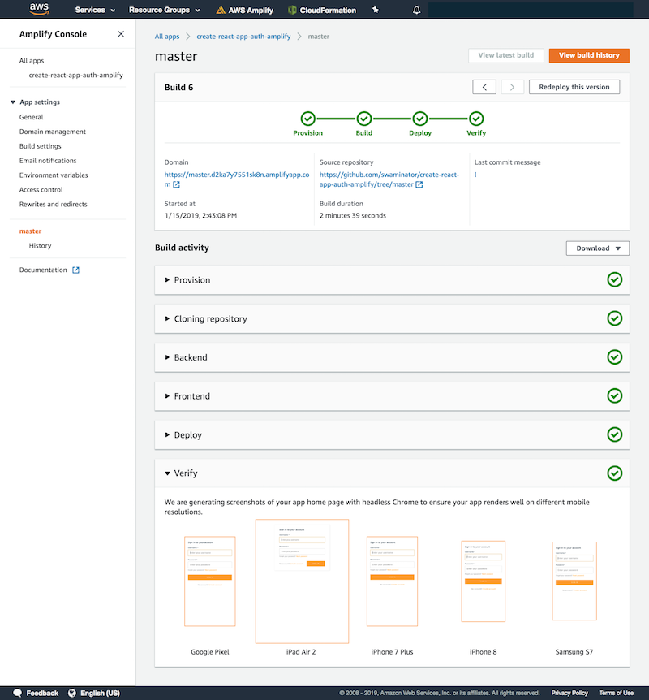

.. _deploy-backend:

########################################################
Serverless Tutorial: Deploying Backend with your Frontend
########################################################

The Amplify Console enables developers building apps with the Amplify Framework to continuously deploy updates to their backend and frontend on every code commit. With the Amplify Console you can deploy serverless backends with GraphQL APIs, authentication, analytics, and storage created by the Amplify CLI. **Note: This feature only works with the Amplify CLI v1.0+**.

In this tutorial, we are going to create and deploy a React app which implements a basic authentication flow for signing up/signing in users as well as protected client side routing using AWS Amplify. 

    * If you are using another frontend framework or Amplify backend category, the same steps can be applied to deploying your backend and frontend with the Amplify Console. The final code for this project is available as a `sample on GitHub <https://github.com/aws-samples/create-react-app-auth-amplify>`__.
    * If you already have an existing Amplify app, please jump to step 6.

1. Install the Amplify CLI to initialize a new Amplify project.

    .. code-block:: none

        npm install -g @aws-amplify/cli

2. Initialize the CLI at the root of your project and name your environment `prod`. You can use the Amplify CLI to add backend functionality to your app. Backend functionality includes all cloud categories such as authentication, analytics, APIs, and storage. 

    .. code-block:: none

        create-react-app myapp
        cd myapp
        amplify init
         Enter a name for the environment: prod

3. Add authentication with sign-in, sign-up, multi-factor auth to your app. Accept all defaults and push the updated project configuration to AWS. It will deploy an Amazon Cognito resource that enables user authentication.

    .. code-block:: none

        amplify add auth
        <accept defaults>
        ...
        amplify push

4. Update your frontend code to add the `withAuthenticator` HOC component to your `App.js` as shown `here <https://github.com/aws-samples/create-react-app-auth-amplify/blob/master/src/App.js>`__. Test your app locally to make sure you see a sign-in screen.

    .. code-block:: none

        npm start

5. Commit your code and upload it to a Git provider of your choice (the Amplify Console supports GitHub, BitBucket, GitLab, and AWS CodeCommit).
 
6. Log in to the `Amplify Console <https://console.aws.amazon.com/amplify/home>`__ and choose **Get Started** under **Deploy**. Connect your Git provider, repository and branch and then choose **Next**. 
   
7. The Amplify Console automatically detects that your repository has an Amplify backend. From the dropdown, choose `dev` (the environment you just created with the CLI). This will update the `backend` phase of the build settings to automatically update the `dev` backend anytime you commit changes to your repository.

    .. code-block:: yaml

        amplifyPush --environment $MY_ENV
                  
    **amplifyPush** - The `amplifyPush script <https://gist.github.com/swaminator/7408de774e24ecf031d0d9928f1fbae5>`__ is a helper script that enables users to specify an environment name as an input and runs the Amplify CLI to create or update an environment.

8. Choose **Next** and **Save and deploy**. Your app build will start by deploying the backend followed by the frontend. Click on your branch name to see the running build. When your build succeeds, you should be able to access your app.

