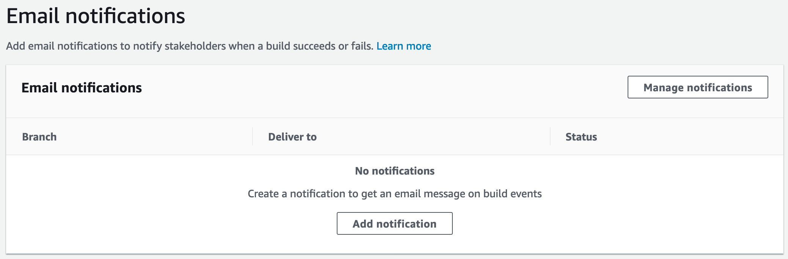
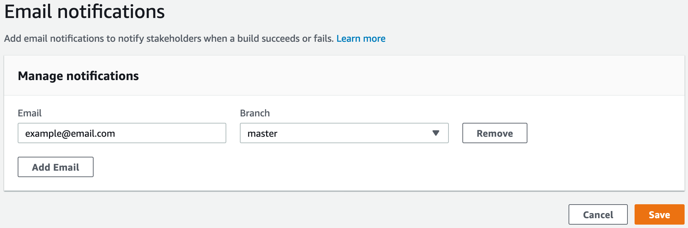

.. _email-notifications:

###############
Email Notifications
###############

Email Notifications allows you to config email notifications. It will not send email by default. Your Branch name must satisfy regular expression pattern: [\.\-_A-Za-z0-9]+.

Add notifications
==========================

