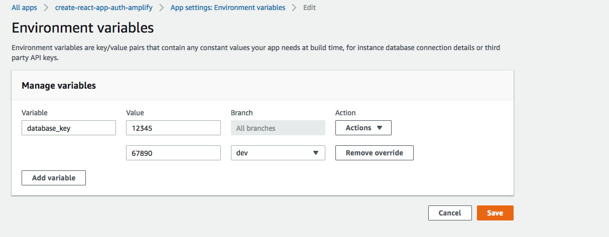

.. _environment-variables:

#############################
Environment Variables
#############################

Environment variables are key-value pairs that are available at build time. These configurations can be anything, including:

* Database connection details
* Third-party API keys
* Different customization parameters
* Secrets

As a best practice, you can use environment variables to expose these configurations. All environment variables that you add are encrypted to prevent rogue access so you can use them to store secret information.

.. _setting_env_vars: 
 
Setting Environment Variables
========================

#. In the Amplify console, choose **App Settings** and then choose **Environment Variables**.

#. In the **key** and **value** fields, enter all your app environment variables. By default, the Amplify console applies the environment variables across all branches, so you don't have to re-enter variables when you connect a new branch. 

#. Choose **Save**.

If you need to customize a variable specifically for a branch, you can add a branch override. To do this, choose **Actions** and then choose **Add variable override**. You now have a set of environment variables specific to your branch. 

.. _access_env_vars: 

Accessing Environment Variables
========================

To access an environment variable during a build, edit your build settings to include the environment variable in your build commands.

#. In the Amplify console, choose **App Settings**, choose **Build settings**, and then choose **Edit**.
   
#. Add the environment variable to your build command. You should now be able to access your environment variable during your next build.

    .. code-block:: yaml

	    build:
	      commands:
	        - npm run build:$BUILD_ENV