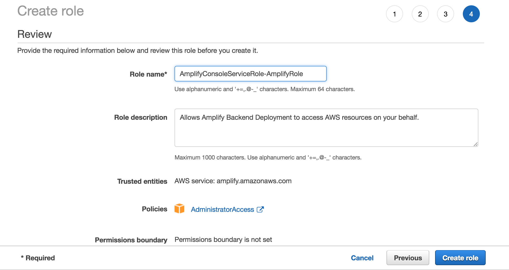
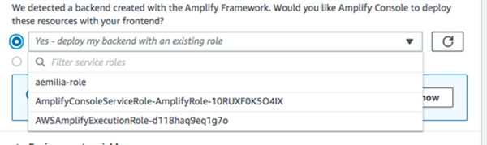
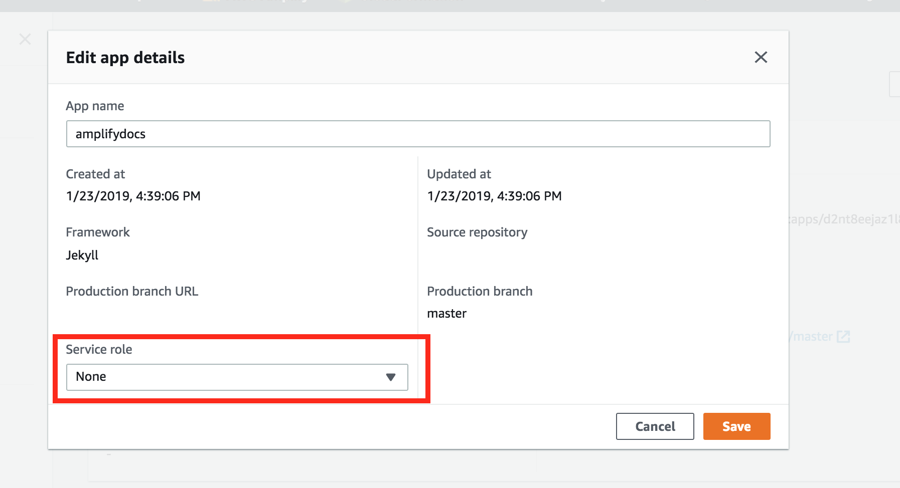

.. _how-to-service-role-amplify-console:

####################################################################
Adding a Service Role to the Amplify Console When You Connect an App
####################################################################

The Amplify Console requires permissions to deploy backend resources with your front end. You use a service role to accomplish this. A service role is the IAM role that Amplify Console assumes when calling other services on your behalf. In this guide, you will create an Amplify service role that has full access to the account which is required to deploy any Amplify CLI resources. `Learn more <https://aws-amplify.github.io/docs/cli/concept>`__.

Step 1: Login to the IAM Console
---------------------------------------

`Login to the IAM Console <https://console.aws.amazon.com/iam/home?#/roles>`__ and choose **Roles** from the left navigation bar, then choose **Create role**.

Step 2: Create Amplify role
-------------------------------------------------------------

In the role selection screen find **Amplify** and select the **Amplify-Backend Deployment** role. Accept all the defaults and choose a name for your role (e.g. AmplifyConsoleServiceRole-AmplifyRole).

Step 3: Return to the Amplify Console
-------------------------------------

In the Amplify Console onboarding screen, choose **refresh**, and then pick the role you just created. It should look like **AmplifyConsoleServiceRole-AmplifyRole**.

If you already have an existing app, you can find the service role setting in **App settings > General** and then choose **Edit** from the top right corner of the box. Pick the service role you just created from the dropdown and choose **Save**.

The Amplify Console now has permissions to deploy backend resources.
