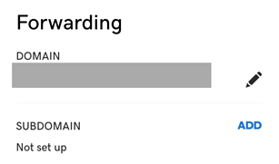
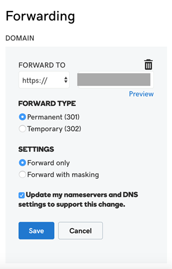
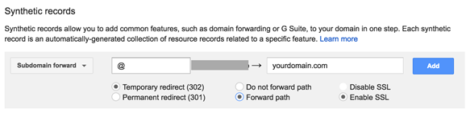

.. _howto-third-party-domains:

########################################
Connecting to Third-Party Custom Domains
########################################

Connecting to a GoDaddy Domain
==================
1. Follow the instructions to :ref:`add a domain <custom-domains>` for third-party providers.

2. Log in to your account at GoDaddy and choose **DNS**.

   .. image:: images/amplify-godaddy-1.png

3. Add CNAME records to to point all subdomains to the **amplifyapp** domain, and another CNAME record to point to Amazon Certificate Manager's validation server. A single validated ACM generates an SSL certificate for your domain. Make sure you only enter the subdomain (for example, *) in **Host** as shown below (don't enter yourdomainname.com).

   .. image:: images/amplify-godaddy-2.png
   .. image:: images/amplify-godaddy-3.png

GoDaddy doesn't support ANAME/ALIAS records. For DNS providers that don't have ANAME/ALIAS support, we strongly recommend `migrating your DNS to Amazon Route 53 <https://docs.aws.amazon.com/Route53/latest/DeveloperGuide/dns-configuring.html>`__. If you want to keep your current provider and update the root domain, add **Forwarding** and set up a domain forward. In **Forward to**, enter the information as shown following:

Connecting to a Google Domain
==================

1. Follow the instructions to :ref:`add a domain <custom-domains>` for third-party providers.

2. Log in to your account at https://domains.google and choose **DNS**.

   .. image:: images/amplify-google-1.png

3. In **Custom resource records**, enter CNAME records that you want to point all subdomains (`https://*.awesomedomain.com`) to the amplifyapp domain, and another CNAME record to point to Amazon Certificate Manager's validation server. A single validated ACM generates an SSL certificate for your domain.

   .. image:: images/amplify-google-2.png

Google domains don't support ANAME/ALIAS records. For DNS providers that don't have ANAME/ALIAS support, we strongly recommend `migrating your DNS to Amazon Route 53 <https://docs.aws.amazon.com/Route53/latest/DeveloperGuide/dns-configuring.html>`__. If you want to keep your current provider and update the root domain, add a **Synthetic Record**, and set up a **Subdomain Forward**. In **Subdomain**, enter the **@** symbol and then choose *Forward path* as shown following:

