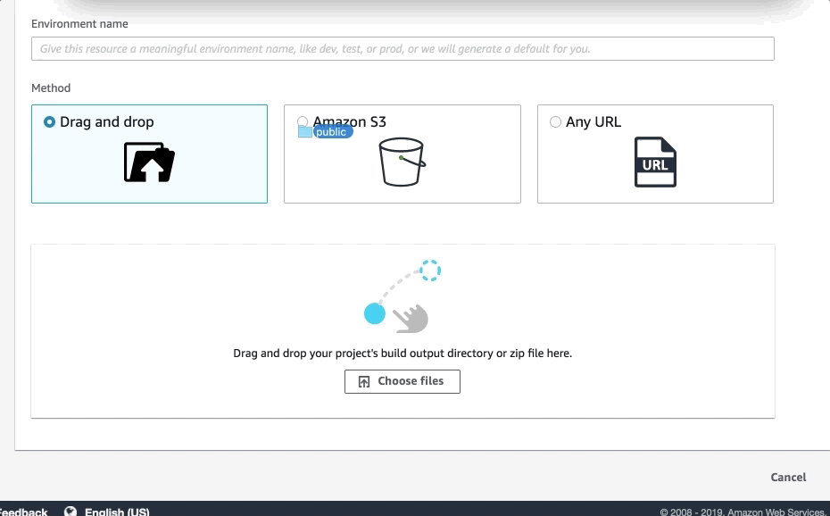
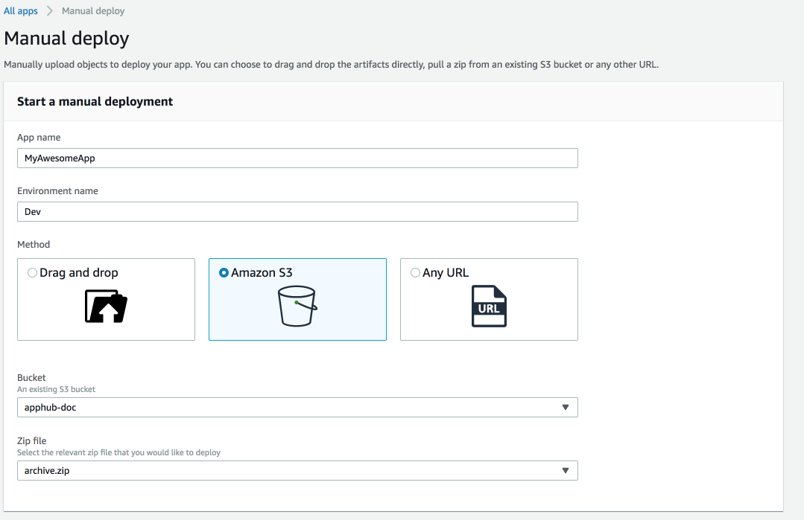

.. _manual-deploys:

###############
Manual Deploys
###############

Manual deploys allows you to publish your web app to the Amplify Console without connecting a Git provider. You can choose to drag and drop a folder from your desktop, or reference an Amazon S3 bucket or external URL. 

Drag and Drop
==========================

Drag and drop a folder from your desktop to host your site in seconds. Log in to the `Amplify Console <https://console.aws.amazon.com/amplify/home>`__ and choose **Deploy without a Git provider**. Give your app a name, and a name for the environment (e.g. development or production). Drag and drop files from your desktop to publish your web app.

Amazon S3 or any URL
==========================

Reference assets that are uploaded to an Amazon S3 bucket, or provide a public URL to files stored elswhere. 

For Amazon S3, choose the bucket and zip file to deploy your site. You can also set up AWS Lambda triggers so your site is updated everytime new assets are uploaded. `This blog post <https://aws.amazon.com/blogs/mobile/deploy-files-s3-dropbox-amplify-console/>`__ walks through setting up a Lambda trigger to automatically deploy changes to Amplify on any updates to a bucket.

**Note:** When you are uploading the zip folder make sure you **zip the contents of your bulid output and not the top level folder**.  For example **if your build output generates a folder named "build" or "public" first navigate into that folder, select all of the contents and zip it from there**.  If you do not do this then you will see an "Access Denied" error because the sites root directory will not be initialized properly.

.. image:: images/zipped-incorrectly-manual-deploy-access-denied.png

