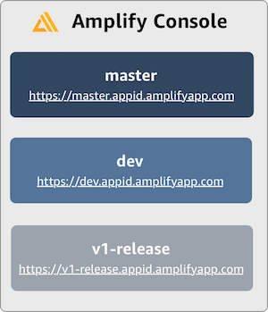
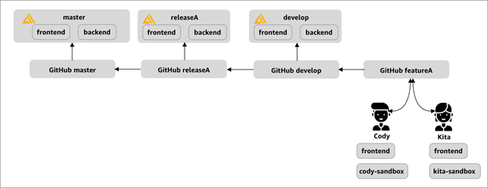

.. _multi-environments:

#################################################
Feature branch deployments and team workflows
#################################################

The Amplify Console leverages Git branches to create new deployments every time a developer connects a new branch in their repository. After connecting your first branch, you can create a new environment by adding a branch as follows:

1. On the branch list page, choose **Connect branch**.

2. Choose a branch from your repository.

3. Save and then deploy your app.

Your app now has two deployments available at `https://master.appid.amplifyapp.com` and `https://dev.appid.amplifyapp.com`.

.. image:: images/amplify-environments-1.png
   :align: center

A feature branch deployment can consist of a **frontend** and (optionally) a **backend**. The frontend is built and deployed to a global CDN, while the backend is deployed by the Amplify CLI to AWS.

Recommended Team Workflow
====================

The Amplify Console is designed to work with feature branch and GitFlow workflows. GitFlow simplifies parallel development by isolating new development from completed work. The following workflow works well with the Amplify Console:

* The **master branch** tracks release code and is your production branch. 
* The **develop branch** is used as an integration branch to test new features with production.
* New development (such as features and non-emergency bug fixes) is done in **feature branches**.
* When the developer is satisfied that the code is ready for release, the feature branch is merged back into the integration develop branch. 
* The only commits to the master branch are merges from release branches and hotfix branches (to fix emergency bugs).

This way beta testers can test unreleased features on the develop branch deployment, without affecting any of the production end users on the master branch deployment.

Feature branch deployments with Amplify CLI environments
===============================

You can use the Amplify Console to continuously deploy backend resources such as GraphQL APIs and Lambda functions with your feature branch deployment. You can use the following models to deploy your backend and frontend with the Amplify Console:

.. contents::
   :local:
   :depth: 1

.. _standard:

Standard - prod, test, and dev backends
~~~~~~~~~~~~~~~~~~~~~~~~~~~~~~~~~~~~~~~~~

* Create **prod**, **test**, and **dev** backend environments with the Amplify CLI.
* Map **prod** and **test** to **master** and **develop** branches.
* Teammates can use the **dev** backend environment to test against from `localhost`.

.. image:: images/amplify-environments-2.png
   :align: center
   :width: 500px

1. Install the Amplify CLI to initialize a new Amplify project.

    .. code-block:: none

        npm install -g @aws-amplify/cli

2. Initialize a `dev` backend environment for your project. If you don't have a project, create one using bootstrap tools like create-react-app or Gatsby.

    .. code-block:: none

        cd next-unicorn
        amplify init
         ? Do you want to use an existing environment? (Y/n): n 
         ? Enter a name for the environment: dev
        ...
        amplify push

3. Add `test` and `prod` backend environments.

    .. code-block:: none

        amplify env add
         ? Do you want to use an existing environment? (Y/n): n 
         ? Enter a name for the environment: test
        ...
        amplify push

        amplify env add
         ? Do you want to use an existing environment? (Y/n): n 
         ? Enter a name for the environment: prod
        ...
        amplify push

4. Push code to a Git repository of your choice (in this example we'll assume you pushed to master).

    .. code-block:: none

        git commit -am 'Added dev, test, and prod environments'
        git push origin master

5. Connect your repo > `master` to the Amplify Console.

6. The Amplify Console will detect backend environments created by the Amplify CLI. Choose `prod` from the dropdown and grant the service role to Amplify Console. Choose **Save and deploy**. After the build completes you will get a master branch deployment available at `https://master.appid.amplifyapp.com`.

7. Connect `develop` branch in Amplify Console (assume `develop` and `master` brach are the same at this point). As soon as you connect the branch, go to `App settings > Environment variables` and add a branch override for USER_ENV as shown below.

8. The Amplify Console is now setup. You can start working on new features in a feature branch. Add backend functionality by using the `dev` backend environment from your local workstation.

    .. code-block:: none

    	git checkout -b newinternet
        amplify env checkout dev
        amplify add api
        ...

9. After you finish working on the feature, commit your code, create a pull request to review internally, and if everything looks good merge the PR to dev.

    .. code-block:: none

    	git commit -am 'Decentralized internet v0.1'
        git push origin newinternet

10. This will kickoff a build in the Amplify Console with a branch deployment at `https://dev.appid.amplifyapp.com`. You can share this link with internal stakeholders so they can review your app.

.. _sandbox:

Per-developer sandbox
~~~~~~~~~~~~~~~~~~~~~~

* Each developer in a team creates a sandbox environment in the cloud that is separate from their local computer. This allows developers to work in isolation from each other without overwriting other team members' changes.
* Each branch in the Amplify Console has its own backend. This ensures that the Amplify Console uses the Git repository as a single source of truth from which to deploy changes, rather than relying on developers on the team to manually push their backend or front end to production from their local computers.

1. Install the Amplify CLI to initialize a new Amplify project.

    .. code-block:: none

        npm install -g @aws-amplify/cli

2. Initialize a `nikhil` backend environment for your project. If you don't have a project, create one using bootstrap tools like create-react-app or Gatsby.

    .. code-block:: none

        cd next-unicorn
        amplify init
         ? Do you want to use an existing environment? (Y/n): n 
         ? Enter a name for the environment: nikhil
        ...
        amplify push

4. Push code to a Git repository of your choice (in this example we'll assume you pushed to master).

    .. code-block:: none

        git commit -am 'Added nikihl sandbox'
        git push origin master

5. Connect your repo > `master` to the Amplify Console.

6. The Amplify Console will detect backend environments created by the Amplify CLI. Choose `Create new environment` from the dropdown and grant the service role to Amplify Console. Choose **Save and deploy**. After the build completes you will get a master branch deployment available at `https://master.appid.amplifyapp.com` with a new backend environment that is linked to the branch.
   
7. Connect `develop` branch in Amplify Console (assume `develop` and `master` brach are the same at this point). After the build completes you will get a develop branch deployment available at `https://develop.appid.amplifyapp.com` with a new backend environment that is linked to the branch.
