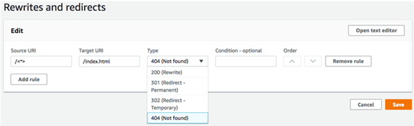
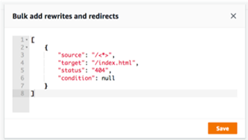

.. _redirects:

###############
Using Redirects
###############

Redirects enable a web server to reroute navigation from one URL to another. Common reasons for using redirects include: to customize the appearance of URL, to avoid broken links, to move the hosting location of an app or site without changing its address, and to change a requested URL to the form needed by a web app.

Types of Redirects
==================
There are several types of redirects that support specific scenarios. 

**Permanent redirect (301)**

301 redirects are intended for lasting changes to the destination of a web address. Search engine ranking history of the original address applies to the new destination address. Redirection occurs on the client-side, so a browser navigation bar shows the destination address after redirection. Common reasons to use 301 redirects include:

* To avoid a broken link when the address of a page changes.
* To avoid a broken link when a user makes a predictable typo in an address.

**Temporary redirect (302)**

302 redirects are intended for temporary changes to the destination of a web address. Search engine ranking history of the original address doesn't apply to the new destination address. Redirection occurs on the client-side, so a browser navigation bar shows the destination address after redirection. Common reasons to use 302 redirects include:

* To provide a detour destination while repairs are made  to an original address.
* To provide test pages for A/B comparison of user interface.

**Rewrite (200)**

200 redirects (rewrites) are intended to show content from the destination address as if it were served from the original address. Search engine ranking history continues to apply to the original address. Redirection occurs on the server-side, so a browser navigation bar shows the original address after redirection. Common reasons to use 200 redirects include:

* To redirect an entire site to a new hosting location without changing the address of the site.
* To redirect all traffic to a single page web app (SPA) to its index.html page for handling by a client-side router function.

**Not Found (404)**

404 redirects occur when a request points to an address that doesn't exist. The destination page of a 404 is displayed instead of the requested one. Common reasons a 404 redirect occurs include:

* To avoid a broken link message when a user enters a bad URL.
* To point requests to nonexistent pages of a web app to its index.html page for handling by a client-side router function.

Parts of a Redirect
===================

Redirects consist of the following:

* An original address - The address the user requested.
* A destination address - The address that actually serves the content that the user sees.
* A redirect type - Types include a permanent redirect (301), a temporary redirect (302), a rewrite (200), or not found (404).
* A two letter country code (optional) - a value you can include to segment the user experience of your app by region

To create and edit redirects, choose **Rewrites and redirects settings** in the left navigation pane.

To bulk edit redirects in a JSON editor, choose **Open text editor**.

Order of Redirects
==================

Redirects are executed from the top of the list down. Make sure that your ordering has the effect you intend. For example, the following order of redirects causes all requests for a given path under `/docs/` to redirect to the same path under `/documents/`, except  `/docs/specific-filename.html` which redirects to `/documents/different-filename.html`:

.. code-block:: none

  /docs/specific-filename.html /documents/different-filename.html 301
  /docs/<*> /documents/<*>

The following order of redirects ignores the redirection of `specific-filename.html` to `different-filename.html`:

.. code-block:: none

  /docs/<*> /documents/<*>
  /docs/specific-filename.html /documents/different-filename.html 301

Simple Redirects and Rewrites
=============================
In this section we include example code for common redirect scenarios. 

You can use the following example code to permanently redirect a specific page to a new address.

  .. list-table::
     :widths: 1, 1, 1, 1

     * - Original address
       - Destination Address
       - Redirect Type
       - Country Code

     * - :code:`/original.html`
       - :code:`/destination.html`
       - :code:`permanent redirect (301)`
       -

  :superscript:`JSON: [{"source": "/original.html", "status": "301", "target": "/destination.html", "condition": null}]`

You can use the following example code to redirect any path under a folder to the same path under a different folder.

  .. list-table::
     :widths: 1, 1, 1, 1

     * - Original address
       - Destination Address
       - Redirect Type
       - Country Code

     * - :code:`docs/<*>`
       - :code:`/documents/<*>`
       - :code:`permanent redirect (301)`
       -

  :superscript:`JSON [{"source": "/docs/<*>", "status": "301", "target": "/documents/<*>", "condition": null}]`

You can use the following example code to redirect all traffic to index.html as a rewrite. In this scenario, the rewrite makes it appear to the user that they have arrived at the original address.

  .. list-table::
     :widths: 1, 1, 1, 1

     * - Original address
       - Destination Address
       - Redirect Type
       - Country Code

     * - :code:`<*>`
       - :code:`/index.html`
       - :code:`rewrite (200)`
       -

  :superscript:`JSON [{"source": "/<*>", "status": "200", "target": "/index.html", "condition": null}]`

You can use the following example code to use a rewrite to change the subdomain that appears to the user.

  .. list-table::
     :widths: 1, 1, 1, 1

     * - Original address
       - Destination Address
       - Redirect Type
       - Country Code

     * - :code:`https://mydomain.com`
       - :code:`https://www.mydomain.com`
       - :code:`rewrite (200)`
       -

  :superscript:`JSON [{"source": "https://mydomain.com", "status": "200", "target": "https://www.mydomain.com", "condition": null}]`

You can use the following example code to redirect paths under a folder that can't be found to a custom 404 page.

  .. list-table::
     :widths: 1, 1, 1, 1

     * - Original address
       - Destination Address
       - Redirect Type
       - Country Code

     * - :code:`/<*>`
       - :code:`/404.html`
       - :code:`not found (404)`
       -

  :superscript:`JSON [{"source": "/<*>", "status": "404", "target": "/404.html", "condition": null}]`

Redirects for Single Page Web Apps (SPA)
========================================

Most SPA frameworks support HTML5 history.pushState() to change browser location without triggering a server request. This works for users who begin their journey from the root (or `/index.html`), but fails for users who navigate directly to any other page. Using regular expressions, the following example sets up a 200 rewrite for all files to index.html except for the specific file extensions specified in the regular expression.

  .. list-table::
     :widths: 1, 1, 1, 1

     * - Original address
       - Destination Address
       - Redirect Type
       - Country Code

     * - :code:`</^[^.]+$|\.(?!(css|gif|ico|jpg|js|png|txt|svg|woff|ttf|map|json)$)([^.]+$)/>`
       - :code:`/index.html`
       - :code:`200`
       -

  :superscript:`JSON [{"source": "</^[^.]+$|\.(?!(css|gif|ico|jpg|js|png|txt|svg|woff|ttf|map|json)$)([^.]+$)/>", "status": "200", "target": "/index.html", "condition": null}]`

Reverse Proxy Rewrite
=====================
The following example uses a rewrite to proxy content from another location so that it appears to user that the domain hasn't changed:

  .. list-table::
     :widths: 1, 1, 1, 1

     * - Original address
       - Destination Address
       - Redirect Type
       - Country Code

     * - :code:`/images`
       - :code:`https://images.otherdomain.com`
       - :code:`rewrite (200)`
       -

  :superscript:`JSON [{"source": "/images", "status": "200", "target": "https://images.otherdomain.com", "condition": null}]`

Trailing slashes and Clean URLs
===================================
To create clean URL structures like `about` instead of `about.html`, static site generators such as Hugo generate directories for pages with an index.html (`/about/index.html`). The Amplify Console automatically creates clean URLs by adding a trailing slash when required. The table below highlights different scenarios:

  .. list-table::
     :widths: 1, 1, 1

     * - User inputs in browser
       - URL in the address bar
       - Document served

     * - :code:`/about`
       - :code:`/about`
       - :code:`/about.html`

     * - :code:`/about (when about.html returns 404)`
       - :code:`/about/`
       - :code:`/about/index.html`
    
     * - :code:`/about/`
       - :code:`/about/`
       - :code:`/about/index.html`

.. Pretty URLs
.. ===========

.. A pretty URL is a common way to simplify an address by removing the .html extension of a page.

.. You can use a redirect to enable a pretty URL that doesn't use a trailing slash as follows:

.. * No redirect required. Amplify treats paths that end in a file name without an extension as pretty URLs by default. For example, :code:`https://www.mydomain.com/prettyurl` and :code:`https://www.mydomain.com/prettyurl.html` point to the same destination.

.. * Make sure no trailing slash is added. For example, :code:`https://www.mydomain.com/prettyurl/` attempts to render :code:`https://www.mydomain.com/prettyurl/index.html`.

.. You can use the following example code to redirect a pretty URL to a new pretty URL temporarily.

..   .. list-table::
..      :widths: 1, 1, 1, 1

..      * - Original address
..        - Destination Address
..        - Redirect Type
..        - Country Code

..      * - :code:`/docs`
..        - :code:`/documents`
..        - :code:`temporary redirect (302)`
..        -

..   :superscript:`JSON [{"source": "/docs", "status": "302", "target": "/documents", "condition": null}]`

Placeholders
============

You can use the following example code to redirect paths in a folder structure to a matching structure in another folder.

  .. list-table::
     :widths: 1, 1, 1, 1

     * - Original address
       - Destination Address
       - Redirect Type
       - Country Code

     * - :code:`/docs/<year>/<month>/<date>/<itemid>`
       - :code:`/documents/<year>/<month>/<date>/<itemid>`
       - :code:`permanent redirect (301)`
       -

  :superscript:`JSON [{"source": "/docs/<year>/<month>/<date>/<itemid>", "status": "301", "target": "/documents/<year>/<month>/<date>/<itemid>", "condition": null}]`

Query Strings and Path Parameters
=================================

You can use the following example code to redirect a path to a folder with a name that matches the value of a query string element in the original address:

  .. list-table::
     :widths: 1, 1, 1, 1

     * - Original address
       - Destination Address
       - Redirect Type
       - Country Code

     * - :code:`/docs?id=<my-blog-id-value`
       - :code:`/documents/<my-blog-post-id-value>`
       - :code:`permanent redirect (301)`
       -

  :superscript:`JSON [{"source": "/docs?id=<my-blog-id-value", "status": "301", "target": "/documents/<my-blog-post-id-value>", "condition": null}]`

You can use the following example code to redirect all paths that can't be found at a given level of a folder structure to index.html in a specified folder.

  .. list-table::
     :widths: 1, 1, 1, 1

     * - Original address
       - Destination Address
       - Redirect Type
       - Country Code

     * - :code:`/documents/<folder>/<child-folder>/<grand-child-folder>`
       - :code:`/documents/index.html`
       - :code:`404`
       -

  :superscript:`JSON [{"source": "/documents/<x>/<y>/<z>", "status": "404", "target": "/documents/index.html", "condition": null}]`

Region-based Redirects
======================

You can use the following example code to redirect requests based on region.

  .. list-table::
     :widths: 1, 1, 1, 1

     * - Original address
       - Destination Address
       - Redirect Type
       - Country Code

     * - :code:`/documents`
       - :code:`/documents/us/`
       - :code:`302`
       - :code:`<US>`

  :superscript:`JSON [{"source": "/documents", "status": "302", "target": "/documents/us/", "condition": "<US>"}]`

