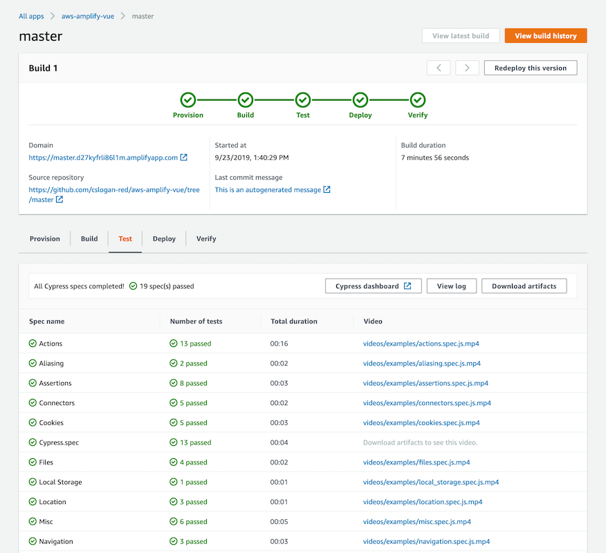

.. _running-tests:

###############
Add End-to-End tests to your app
###############

You now run end-to-end (E2E) tests in the test phase of your Amplify app to catch regressions before pushing code to production. The test phase can be configured in the build specification YML and can be used to run any testing framework of your choice during a build.

Tutorial: Set up end-to-end tests with Cypress
==========================

Cypress is a JavaScript-based framework that allows you to run E2E tests on a browser. `This tutorial <https://aws.amazon.com/blogs/mobile/run-end-to-end-cypress-tests-for-your-fullstack-ci-cd-deployment-with-amplify-console/>`__ will demonstrate how to set up E2E tests from scratch.

Add tests to your existing Amplify app
==========================

You can use the test step to run any test commands at build time. For E2E tests, the Amplify Console offers a deeper integration with Cypress that allows you to generate a UI report for your tests. To add Cypress tests to an existing app, update your amplify.yml build settings with the following values. 

.. code-block:: yaml

  test:
    phases:
      preTest:
        commands:
          - npm install
          - npm install wait-on
          - npm install  mocha@5.2.0 mochawesome mochawesome-merge mochawesome-report-generator
          - 'npm start & npx wait-on http://localhost:8080'
      test:
        commands:
          - 'npx cypress run --reporter mochawesome --reporter-options "reportDir=cypress/report/mochawesome-report,overwrite=false,html=false,json=true,timestamp=mmddyyyy_HHMMss"'
      postTest:
        commands:
          - npx mochawesome-merge --reportDir cypress/report/mochawesome-report > cypress/report/mochawesome.json
    artifacts:
      baseDirectory: cypress
      configFilePath: '**/mochawesome.json'
      files:
        - '**/*.png'
        - '**/*.mp4'

* **preTest** - Install all the dependencies required to run Cypress tests. Amplify Console uses `mochaawesome <https://github.com/adamgruber/mochawesome`__ to generate a report to view your test results and `wait-on <https://github.com/jeffbski/wait-on>`__ to set up the localhost server during the build.
* **test** - Run cypress commands to execute tests using mochawesome.
* **postTest** - The mochawesome report is generated from the output JSON.
* **artifacts>baseDirectory** - The directory from which tests are run.
* **artifacts>files** - The generated artifacts (screenshots and videos) available for download.
