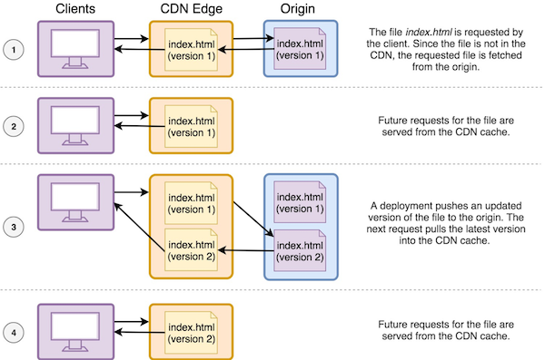

.. _ttl:

###############################
Instant Cache Invalidations
###############################

The Amplify Console supports instant cache invalidation of the CDN on every code commit. This enables you to deploy updates to your single page or static app instantly — without giving up the performance benefits of content delivery network (CDN) caching.

`Learn more <https://aws.amazon.com/blogs/mobile/aws-amplify-console-supports-instant-cache-invalidation-and-delta-deployments/>`__ about how the Amplify Console handles cache invalidations.

